# Formula SAE Electrical Systems Portfolio

## Paddle-Shifting Controller, Ignition-System Support, Harness Installation, and Vehicle Electrical Integration

**Author:** Joshua Chukwuebuka Nwaneli  
**Project:** Project Lazarus — Oral Roberts University Formula SAE 2026  
**Public team site:** [oruracing.com](https://oruracing.com)  
**Focus Areas:** Embedded control, actuator control, ignition-system support/debugging, vehicle wiring, relay logic, shutdown safety, harness installation, and electrical documentation.

---

## Overview

This repository documents selected electrical and embedded-systems work from ORU's Formula SAE Project Lazarus. The vehicle used a Suzuki GSX-R600 motorcycle engine, which required adapting a motorcycle wiring harness into a custom Formula SAE race car platform.

The electrical work included ECU/ECM connections, ignition and starter behavior, sensors, relays, shutdown devices, brake light control, cooling fan control, driver inputs, physical harness installation, and an Arduino-based paddle-shifting subsystem.

My primary individual work was the **paddle-shifting system**. I was also **heavily involved in ignition-system debugging/implementation**, and I contributed to the broader **harness installation and vehicle electrical integration** work with the electrical team.

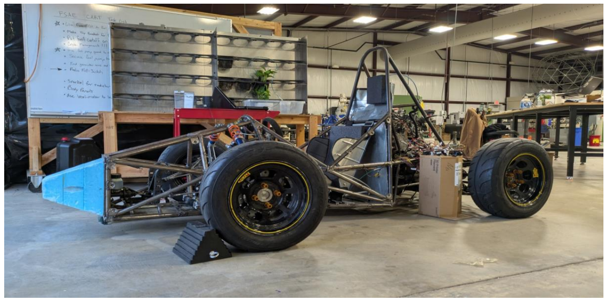

---

## Project Status

This repository documents the work completed during the 2026 Formula SAE senior design cycle. At the time of documentation, the electrical system was approximately **90% complete**. Remaining work mainly involved mounting a few harness-related components and completing final vehicle-level installation and testing.

Because ORU is a smaller school and the team consisted of only nine students working with limited budget and resources, the overall car build was extended into a two-year project. The legacy harness shown in this repository was inherited from a previous team, and our work focused on understanding, modifying, documenting, and installing an updated system for the current FSAE vehicle.

---

## Contribution Summary

### Individual Contribution — Paddle-Shifting System

I designed and developed the Arduino-based paddle-shifting control system. The system allowed steering-wheel paddle inputs to command a linear actuator through an H-bridge motor driver for shifting the sequential Suzuki GSX-R600 transmission.

The subsystem used:

- Arduino Uno microcontroller
- Up-shift and down-shift paddle switches
- Clutch switch input
- H-bridge motor driver
- Linear actuator
- Buck converter for 12 V to 5 V conversion
- Actuator position feedback through analog input
- Fuse protection and vehicle harness integration

The firmware implements:

- Upshift, downshift, and neutral-shift routines
- Debounce handling for paddle inputs
- Clutch-gated shift behavior
- Lockout timing after shift commands
- Actuator position feedback using analog input
- Move timeout protection
- Return-to-neutral behavior after each shift

### Major Team Contribution — Ignition-System Debugging and Implementation

I was heavily involved in the ignition-system debugging and implementation work. A major issue was that the ECU would not command the fuel pump to prime even though voltage was present at the ignition-related wires. The system showed an ignition-switch-related fault, which meant the problem was not simply missing voltage; the ECU expected the ignition input to behave like the original Suzuki ignition switch.

As part of the ignition-system work, the ignition path was tested using resistance values on the ignition signal. A **150 Ω resistor** was used to reproduce the ignition-switch condition needed by the ECU. This work helped restore proper ignition recognition and fuel pump priming behavior.

### Team Contribution — Harness Installation and Electrical Integration

I also contributed to the broader electrical team effort, including harness installation and vehicle electrical integration. Since the harness work was shared by the electrical team, I describe this part as team-level work that I participated in. This included working with the GSX-R600 harness, routing and connecting wiring, integrating switches and relays, preparing circuits for testing, and helping the system move from schematic-level design to physical vehicle wiring.

---

## Repository Structure

```text
fsae-electrical-systems-portfolio/
├── README.md
├── PROJECT_WRITEUP.md
├── UPLOAD_CHECKLIST.md
├── docs/
│   ├── FSAE_2026_Final_Report_04_29_2026.pdf
│   └── Full_Electrical_Schematic_2_0.pdf
├── firmware/
│   └── paddle_shift_controller.ino
└── assets/
    └── selected_report_excerpts/
```

---

## Key Artifacts

### Full Electrical Schematic and Harness Mapout

The full schematic shows the integrated vehicle electrical system, including ECU/ECM wiring, ignition/fuel circuits, relays, sensors, shutdown devices, brake light, cooling fan, and the paddle-shifting subsystem.

- [`docs/Full_Electrical_Schematic_2_0.pdf`](docs/Full_Electrical_Schematic_2_0.pdf)
- [`docs/FSAE_2026_Final_Report_04_29_2026.pdf`](docs/FSAE_2026_Final_Report_04_29_2026.pdf)

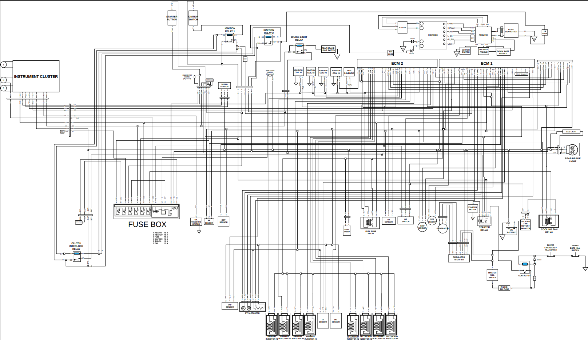

### Legacy Harness Context

The legacy harness was inherited from a previous team. It served as the starting point for understanding the original motorcycle wiring and deciding how the system needed to be modified for the current Formula SAE vehicle.

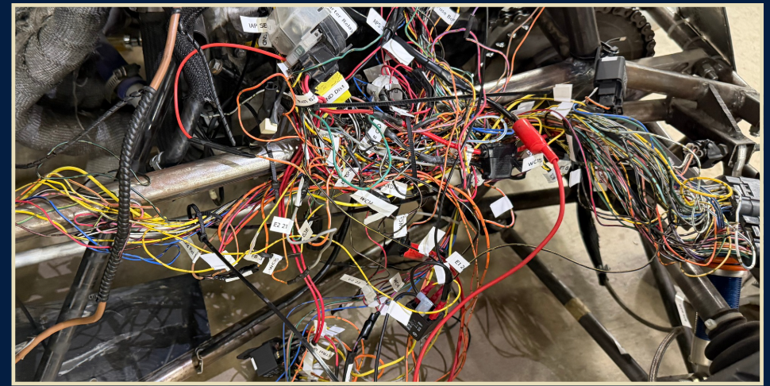

### Physical Harness Installation

The physical harness screenshots show the vehicle-level wiring installation and routing work. This was part of the shared electrical-team effort to move the system from schematic documentation to a real car harness.

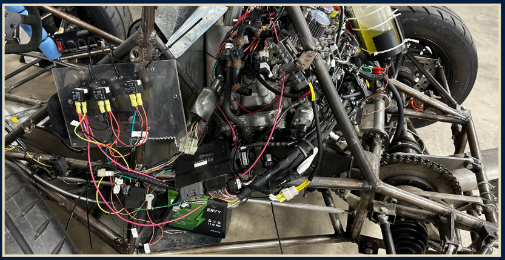

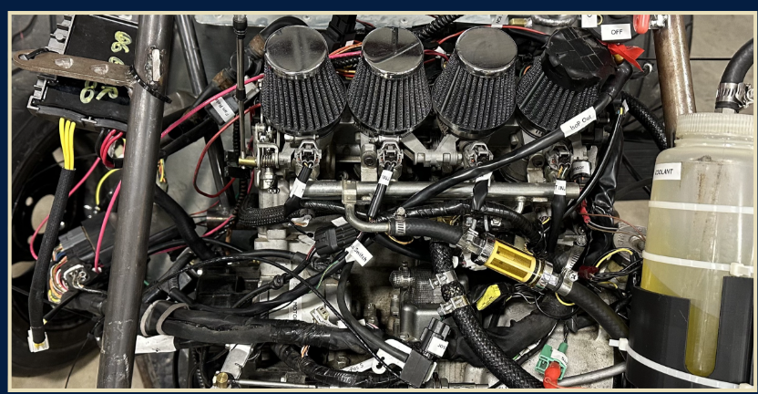

---

## Paddle-Shifting Subsystem

The paddle-shifting subsystem used an Arduino, H-bridge, buck converter, clutch switch, paddle switches, actuator feedback, and actuator motor lines. The Arduino used D2/D3 for paddle inputs, D4 for clutch logic, D9/D10 for H-bridge motor control, and A0 for actuator feedback.

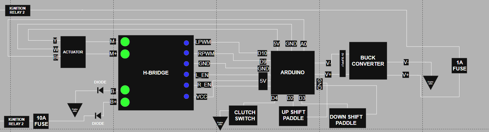

### Paddle-Shift Hardware

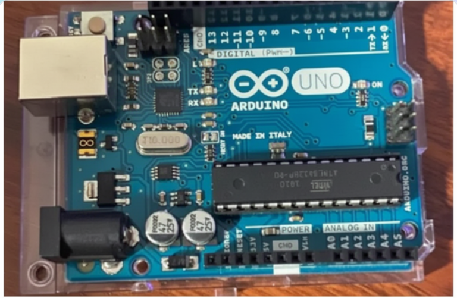

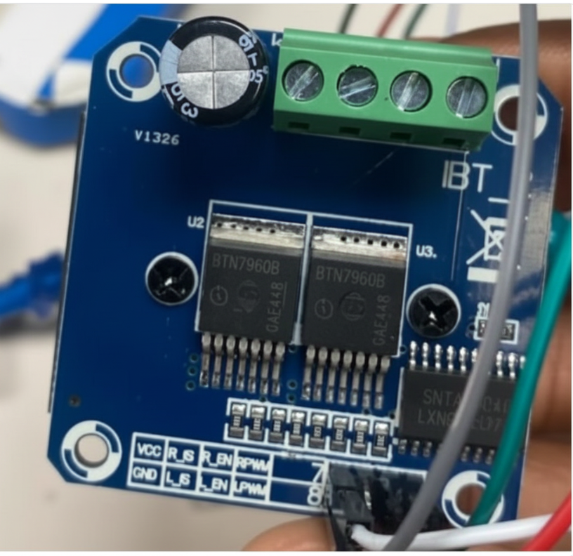

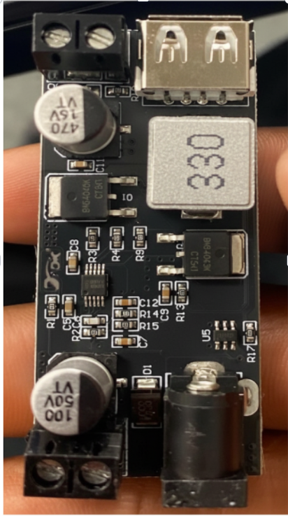

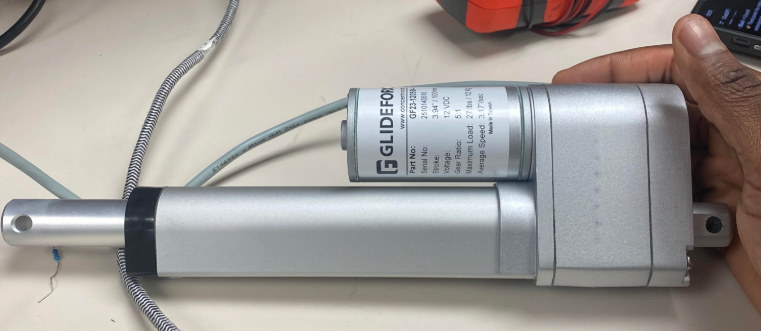

### Firmware

- [`firmware/paddle_shift_controller.ino`](firmware/paddle_shift_controller.ino)

---

## Ignition System

The ignition-system work focused on adapting the original Suzuki ignition behavior so the ECU would recognize the circuit correctly. This included studying the OEM ignition switch behavior, testing the ignition circuit, and implementing the resistor condition needed for proper ECU/fuel-pump behavior.

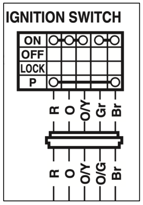

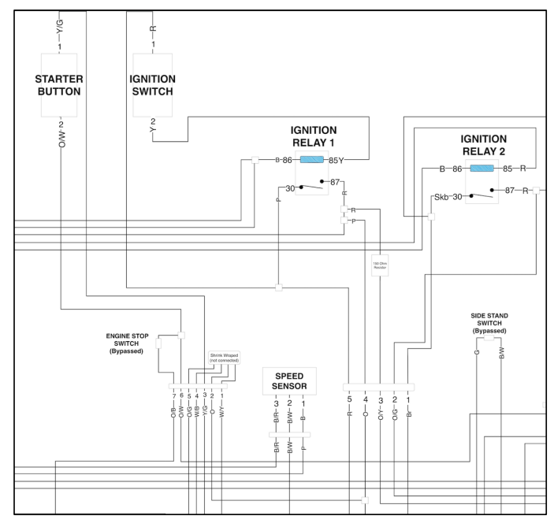

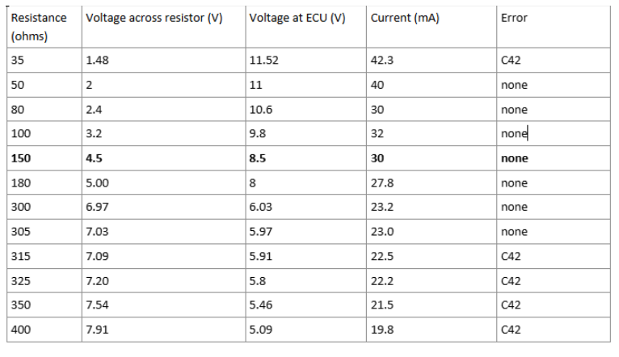

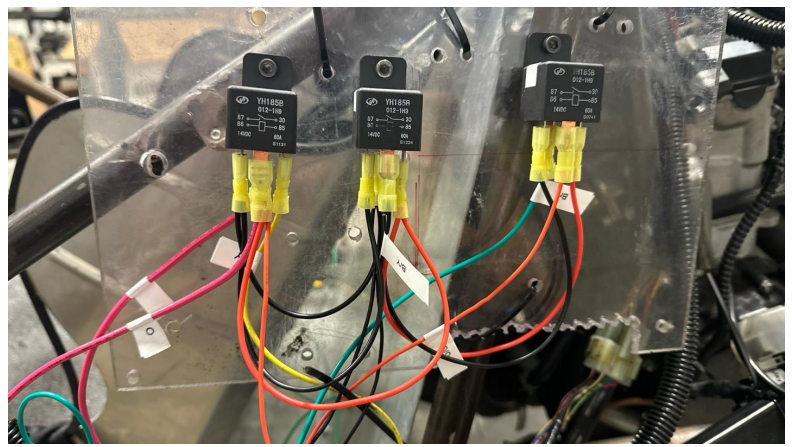

### Starter and Ignition Support Circuits

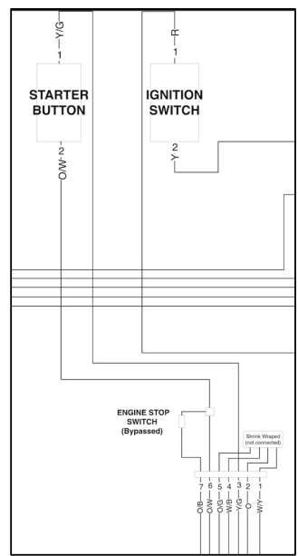

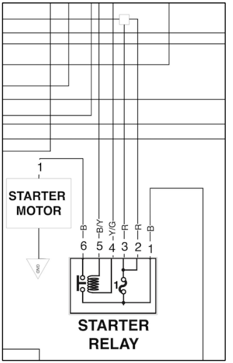

---

## Shutdown and Safety Circuit

The shutdown circuit includes the master kill switch, driver emergency kill switch, Brake Over-Travel Switch, contactor, inline fuse protection, and flyback-diode protection.

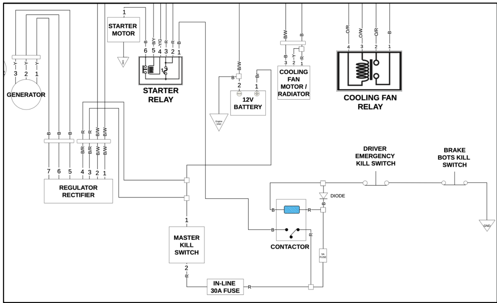

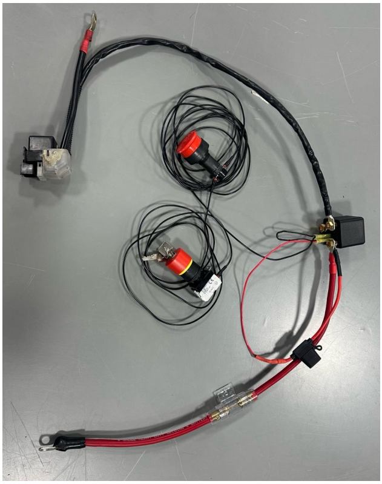

---

## Skills Demonstrated

- Embedded control using Arduino
- Motor driver control using H-bridge outputs
- Actuator position feedback and movement targets
- Vehicle wiring and harness integration
- 12 V automotive-style electrical systems
- Relay logic and fuse-protected circuits
- Ignition-system debugging with ECU behavior
- Shutdown circuit awareness and safety integration
- Technical documentation using schematics, report figures, and firmware

---

## Note on Scope

This repository is a portfolio summary, not the entire Formula SAE project. My individual focus was the paddle-shifting system. I was heavily involved in the ignition-system work, while the harness installation and broader electrical integration work were completed as part of the electrical team.
